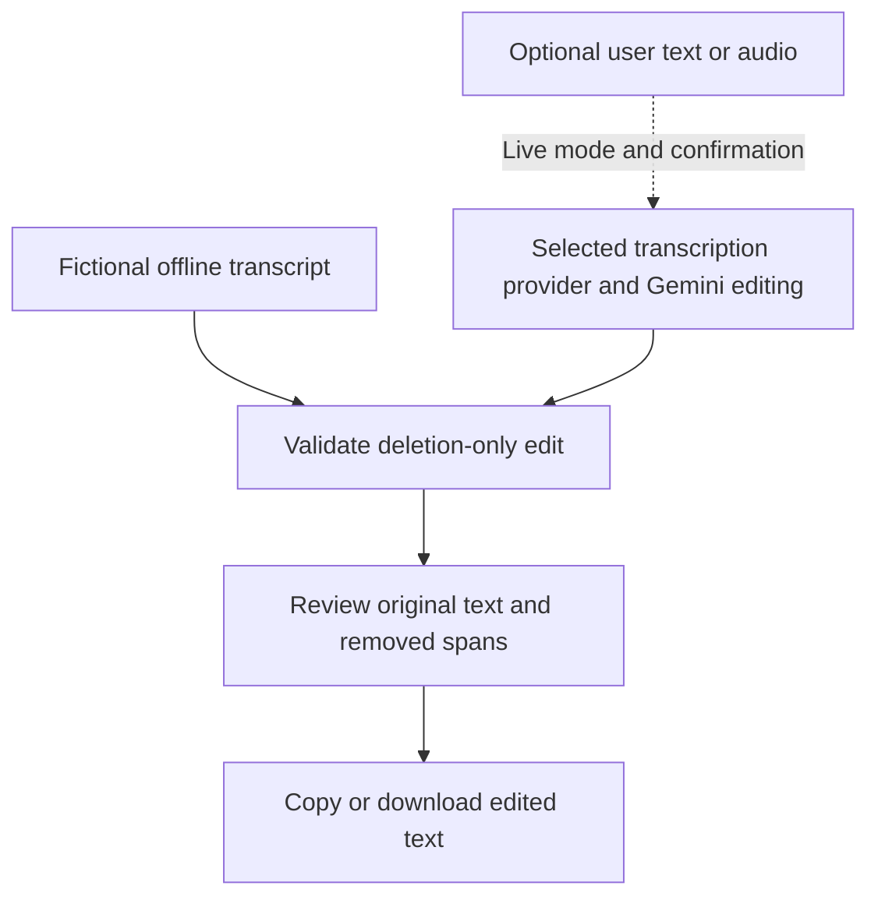

# Auto Podcast Editor

A browser workspace for reviewing proposed cuts to interview transcripts. Load the built-in fictional interview to explore the original text, proposed edit, and highlighted removals without an account or API key.

Optional provider integrations can transcribe audio and propose transcript edits. The app exports **text**; it does not cut, render, or export edited audio.



## Try the offline demo

Requires Node.js 20.19 or later and npm. The release checks used Node.js 23.9.0 and existing local dependencies; a fresh installation has not been verified.

```sh
npm ci --ignore-scripts
npm run dev
```

Open the local address printed by Vite and select **Load synthetic demo**. No key is needed. The checked-in demo is an authored fixture, not a model-generated result or a real interview. Live provider controls are disabled by default.

The installation command downloads dependencies and deliberately skips lifecycle scripts. Review the lockfile before installing. If your platform needs a dependency build step, inspect that dependency's instructions before running it; this preparation did not install packages or run downloaded setup scripts.

```sh
npm test
npm run build
npm run preview
```

## What the project demonstrates

- React interfaces for transcript input, audio selection, edit review, and text export.
- A provider boundary that rejects invalid JSON and edits that add, rewrite, or reorder words.
- A source-aligned deletion view, including complete deletion and long passages.
- Derived removal records instead of trusting model-generated explanations or timestamps.
- Explicit provider selection and confirmation before content is sent off-device.

The validator compares whitespace-delimited tokens, including their punctuation and case. An accepted edit must be a subsequence of the original. Whitespace may change, and repeated tokens are matched from left to right. **Deleting words can still change meaning**: a removed negation, speaker label, caveat, or timestamp needs human review. This is a structural check, not a guarantee of editorial quality or factual accuracy.

## Optional live mode

Copy `.env.example` to `.env.local`, set `VITE_ENABLE_LIVE_API=true`, and restart Vite (or rebuild). This flag is public configuration, not a secret. Never place provider keys in a `VITE_*` variable or a committed file.

In **API Settings**, provide a Gemini key and an explicit model ID supported by your account. An optional OpenAI key selects Whisper for audio transcription; without it, audio goes to the configured Gemini model. Editing always uses Gemini. Applying settings makes no connection test or generation request. Starting processing asks for confirmation and may incur provider charges.

Keys are held in this tab's JavaScript memory, not saved by this version to browser storage. Refreshing clears them. Browser memory is not a secure server-side secret store; use this as a personal prototype, not a hosted service for other users' credentials. Previously stored keys from an older version are not read or removed automatically; clear that site's browser storage if upgrading.

Live compatibility, model availability, audio limits, account permissions, pricing, and provider policies were not verified. The pinned provider SDK is inherited from the original source and has not been upgraded. See [privacy and data flow](docs/PRIVACY.md) before enabling live mode.

## Project layout

| Path | Purpose |
| --- | --- |
| `src/App.jsx` | Input, demo, configuration, and review state |
| `src/components/` | Upload, settings, prompt editor, and transcript comparison |
| `src/services/geminiService.js` | Optional transcription and editing calls |
| `src/lib/transcriptValidation.js` | Response validation and source-aligned deletions |
| `src/examples/`, `examples/` | Fictional demo source and readable fixtures |
| `tests/` | Local validation and mocked-provider regression tests |

See [architecture](docs/ARCHITECTURE.md), [validation results and limits](docs/VALIDATION.md), and [attribution and license status](LICENSE_STATUS.md).

## Attribution

Original application by Ved Sarkar. Portfolio preparation added the synthetic demo, stricter edit validation, mocked tests, documentation, and revised credential handling with AI assistance. See [attribution and license status](LICENSE_STATUS.md) for the scope of those changes.

No original-code license has been selected. Dependency licenses remain their respective owners' terms.
