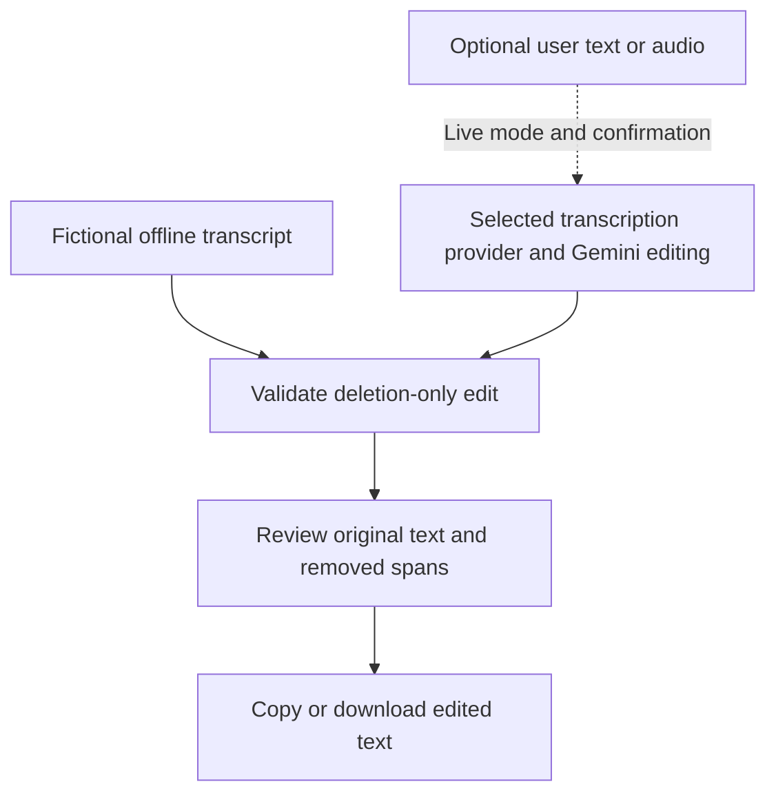
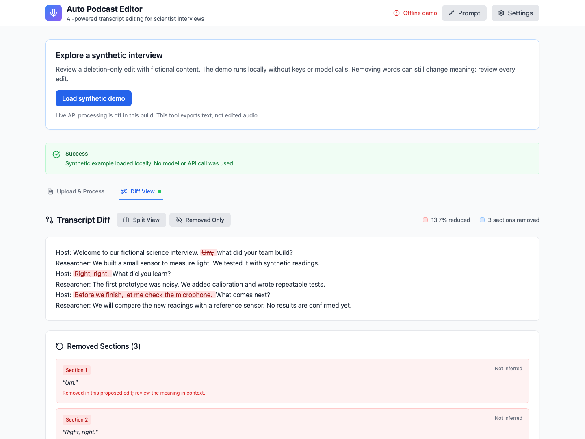
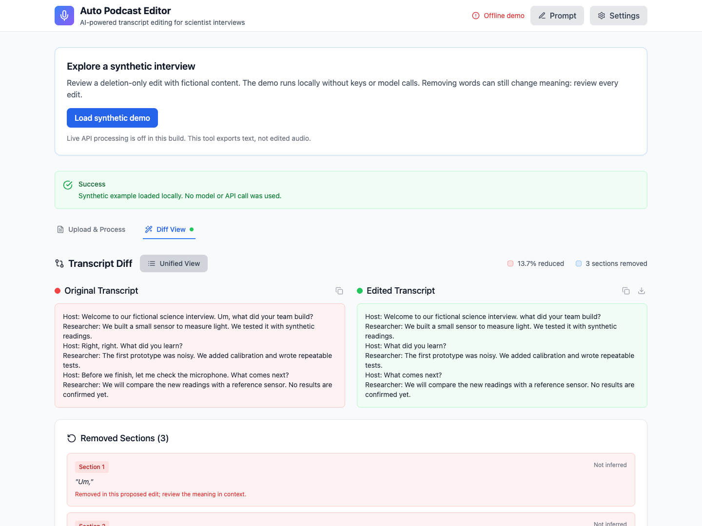

# Auto-Podcast

A browser workspace for reviewing proposed cuts to interview transcripts. Load the built-in fictional interview to explore the original text, proposed edit, and highlighted removals without an account or API key.

## Why I built it

I started Auto-Podcast in 2023 to help my sister, who was editing long research podcasts while doing her PhD. Working through hours of recordings meant spending a lot of time on filler words, silences, and repetition. I wanted a tool that could handle that first editing pass so she could spend more of her time on the content.

## What it does today

The current version supports deletion-only transcript review and **text export**, with optional provider integrations for transcription and proposed edits. It does not cut or export edited audio.



## Review a proposed edit

The review starts with the source text. In the unified view, proposed removals stay visible in context instead of disappearing into a rewritten transcript. The fictional example below makes three deletions; each removed span is also listed for inspection.



*Three proposed cuts remain visible in the original text.*

Switch to the split view to compare the original and edited text side by side before using the copy or text-download controls. Keeping the two versions together makes it easier to check whether a deletion changes the speaker’s meaning.



*The same proposed edit in split view, ready for a final comparison.*

These screenshots show the actual React interface running the authored offline fixture. [Capture scope](docs/SCREENSHOTS.md)

## Try the offline demo

Requires Node.js 20.19 or later and npm. Recorded release checks used Node.js 23.9.0 and existing local dependencies. [Validation scope](docs/VALIDATION.md)

```sh
npm ci --ignore-scripts
npm run dev
```

Open the local address printed by Vite and select **Load synthetic demo**. No key is needed; live provider controls are disabled by default.

`--ignore-scripts` skips dependency lifecycle scripts. Review the lockfile and any platform-specific build step before running it.

```sh
npm test
npm run build
npm run preview
```

## What the project demonstrates

- React interfaces for transcript input, audio selection, edit review, and text export.
- A provider boundary that rejects invalid JSON and edits that add, rewrite, or reorder words.
- A source-aligned deletion view, including complete deletion and long passages.
- Derived removal records instead of trusting model-generated explanations or timestamps.
- Explicit provider selection and confirmation before content is sent off-device.

An accepted edit preserves the original token order, punctuation and case; whitespace may change, and repeated tokens are matched from left to right. **Deletions still need human review**: removing a negation, speaker label or caveat can change the meaning.

## Optional live mode

Copy `.env.example` to `.env.local`, set `VITE_ENABLE_LIVE_API=true`, and restart Vite (or rebuild). The flag is public configuration; enter provider keys only through **API Settings**, never in `VITE_*` variables or committed files.

Provide a Gemini key and supported model ID. Editing uses Gemini; audio transcription uses Whisper when an OpenAI key is supplied, otherwise Gemini. Processing asks for confirmation before sending content to the provider and may incur charges.

Keys stay in this tab's memory and clear on refresh. If upgrading from an older version, clear any keys previously saved in the site's browser storage. This credential flow is intended for personal use.

Live provider compatibility has not been verified with the inherited SDK version. See [privacy and data flow](docs/PRIVACY.md) before enabling this mode.

## Project layout

| Path | Purpose |
| --- | --- |
| `src/App.jsx` | Input, demo, configuration, and review state |
| `src/components/` | Upload, settings, prompt editor, and transcript comparison |
| `src/services/geminiService.js` | Optional transcription and editing calls |
| `src/lib/transcriptValidation.js` | Response validation and source-aligned deletions |
| `src/examples/`, `examples/` | Fictional demo source and readable fixtures |
| `tests/` | Local validation and mocked-provider regression tests |

See [architecture](docs/ARCHITECTURE.md), [validation results and limits](docs/VALIDATION.md), and [attribution and license status](LICENSE_STATUS.md).

## Attribution

Original application by Ved Sarkar. Portfolio preparation added the synthetic demo, stricter edit validation, mocked tests, documentation, and revised credential handling with AI assistance. See [attribution and license status](LICENSE_STATUS.md) for the scope of those changes.

No original-code license has been selected. Dependency licenses remain their respective owners' terms.
