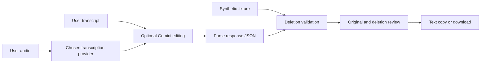

# Architecture

The React application runs in a browser, bundled by Vite with Tailwind CSS. It has no application server, user accounts, database, or audio-rendering pipeline.

The demo goes directly to local validation. Live requests are disabled by the default build flag; the UI additionally requires configuration and confirmation before processing. This flag is a product control, not a security boundary against someone modifying their own client.

The service selects OpenAI Whisper for transcription only when an OpenAI session key is configured; otherwise it selects Gemini. A failed selected provider returns an error and does not silently send content to another provider. Gemini receives transcripts for proposed edits. Provider errors are replaced with generic messages rather than logging raw responses.

`parseEditingResponse` accepts JSON, optionally enclosed in one complete code fence. `validateEditedTranscript` requires an `editedTranscript` string and checks optional metadata container types. It replaces model explanations with removal spans derived from the original source.

`alignDeletions` greedily matches edited tokens in source order. `buildDeletionDiff` groups the original string into retained and removed spans. Repeated identical words can make the exact intended deletion ambiguous; the displayed alignment is one valid left-to-right match. Whitespace normalization is allowed. Source and edited text are limited to 100,000 JavaScript string code units, and the provider response to 400,000.

The algorithm checks structure, not meaning. It does not validate speaker attribution, scientific claims, transcription accuracy, audio timing, or editorial intent. No inferred timestamps are presented as measurements.

Future work requiring separate validation includes browser interaction coverage, provider SDK modernization, live model compatibility, audio-size handling, and a server-side credential architecture if this becomes a shared service.
